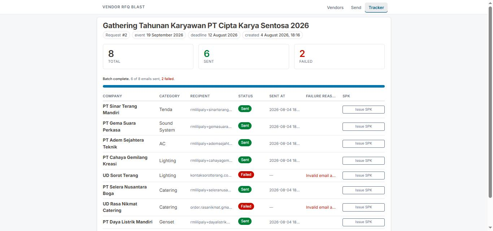
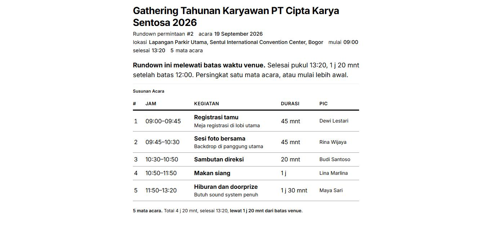

# Event Ops

Internal tool untuk event organizer. Satu acara ditangani dari mencari vendor
sampai hari-H: sebar RFQ ke banyak vendor sekaligus, terbitkan SPK untuk yang
menang, lalu susun rundown acaranya. Ketiganya menggantung pada satu baris
`requests` — satu acara, satu benang, tanpa menyalin data antar modul.

## Masalah

Untuk satu acara, staf procurement mengirim RFQ ke vendor satu per satu lewat
email: 25 vendor berarti 25 kali menyalin brief yang sama dan mengganti nama PT
dan nama PIC. Setelah terkirim tidak ada catatan siapa saja yang sudah
dihubungi, SPK untuk vendor yang menang diketik ulang di Word, dan rundown
hari-H hidup di spreadsheet terpisah yang jam-jamnya harus dihitung ulang
manual setiap ada satu durasi berubah.

## Tiga modul

### 1. Vendor & RFQ blast

Data vendor disimpan beserta kategorinya — tenda, sound system, lighting,
katering, AC, genset — dan status aktif/nonaktif. Satu vendor boleh masuk
beberapa kategori sekaligus, karena vendor tenda biasanya juga menyediakan
kursi dan panggung.

Brief acara diisi sekali, vendor dicentang lintas kategori, lalu sistem
merender satu email personal per vendor. Preview wajib: tombol kirim tidak
pernah mengirim langsung, email contoh selalu ditampilkan dulu. Pengiriman
jalan di background dengan jeda antar email, dan satu email gagal dicatat
sebagai `failed` lalu batch lanjut — tidak pernah menghentikan sisanya.
Halaman tracker menampilkan status per vendor beserta pesan error yang sudah
diterjemahkan jadi kalimat biasa.

Alur: **brief → pilih kategori + centang vendor → preview → kirim → tracker**



*Tracker satu batch. Yang gagal tidak menghentikan sisanya, dan alasannya
ditampilkan sebagai kalimat biasa — error SMTP mentahnya tetap tersimpan.*

### 2. Penerbitan SPK

Setelah vendor menang, SPK (Surat Perintah Kerja) diterbitkan langsung dari
baris vendor itu di tracker. Yang diisi hanya harga, lingkup kerja, dan termin
pembayaran; nama PT, PIC, judul acara, tanggal, dan lokasi diambil dari data
yang sudah ada.

Nomor surat dialokasikan sekali saat baris disimpan, di dalam transaksi, dan
tidak pernah dihitung ulang — dokumen yang dicetak ulang bulan depan tetap
membawa nomor aslinya. Hasilnya file `.docx` berbahasa Indonesia, dengan harga
dieja menjadi terbilang ("lima belas juta rupiah"). Satu SPK per pasangan
acara–vendor; menerbitkan ulang berarti mengedit yang sudah ada.

### 3. Rundown acara

Susunan acara hari-H: daftar kegiatan berurutan dengan durasi, PIC, dan
catatan. Jam mulai dan selesai tiap item tidak pernah disimpan — semuanya
dihitung ulang dari jam mulai acara ditambah durasi kumulatif. Ubah durasi satu
item, semua jam di bawahnya bergeser sendiri. Item bisa dinaikkan, diturunkan,
atau dihapus, dan urutannya selalu rapat tanpa nomor bolong.

Rundown boleh melewati tengah malam: mulai 22:00 dengan total 4 jam berarti
selesai 02:00. Kalau venue punya batas waktu dan acaranya lewat, halaman
memberi peringatan beserta selisih menitnya — memberi tahu, bukan memblokir,
karena acara yang molor tetap acara yang nyata. Halamannya bisa langsung
dicetak: aturan `@media print` menyembunyikan seluruh chrome aplikasi dan
menyisakan jadwalnya saja, seluruhnya dalam bahasa Indonesia karena lembar itu
dipegang kru dan vendor di lokasi.



*Halaman yang sama saat dicetak. Tanpa nav, tanpa tombol, hitam di atas putih,
dan peringatan lewat batasnya jadi kalimat biasa supaya tetap terbaca kalau
dicetak hitam-putih.*

## Stack

Python 3.12 · FastAPI · Jinja2 · HTMX · SQLite dengan raw SQL · aiosmtplib +
Gmail SMTP · python-docx · Pico.css v2 lewat CDN.

Tanpa ORM, tanpa framework frontend, tanpa build step. Semua query di `db.py`,
logika domain tanpa lapisan web di `core/`, satu router per area di `routes/`,
dan seluruh CSS custom dalam satu blok `<style>` di `templates/base.html`.

## Cara menjalankan

```bash
python -m venv .venv
.venv\Scripts\activate          # Windows; macOS/Linux: source .venv/bin/activate
pip install -r requirements.txt

copy .env.example .env          # macOS/Linux: cp .env.example .env
python init_db.py               # skema + seed: 6 kategori, 25 vendor, 1 contoh acara

uvicorn main:app --reload
```

Buka http://127.0.0.1:8000 — otomatis diarahkan ke `/vendors`.

### Konfigurasi `.env`

| Variabel | Default | Keterangan |
| --- | --- | --- |
| `SMTP_HOST` | `smtp.gmail.com` | Server SMTP |
| `SMTP_PORT` | `587` | Port STARTTLS |
| `SMTP_USER` | — | Alamat Gmail pengirim |
| `SMTP_PASS` | — | **App password**, bukan password akun |
| `SMTP_FROM_NAME` | — | Nama tampil pengirim |
| `DRY_RUN` | `true` | `true` = tidak ada koneksi SMTP sama sekali, isi email hanya dicetak ke log |
| `SEND_DELAY_SECONDS` | `2` | Jeda antar email |
| `DB_PATH` | `db/rfq.db` | Lokasi file SQLite |

`DRY_RUN=true` adalah default yang disengaja: demo bisa dijalankan penuh sampai
tracker tanpa satu pun email benar-benar terkirim.

```bash
python config.py                # tampilkan konfigurasi yang terbaca
python cek_email.py             # kirim satu email percobaan
python init_db.py               # bangun ulang database dari nol (menghapus yang ada)
```

## Batas scope

Ini MVP demo, bukan aplikasi produksi. Yang berikut **sengaja tidak dibangun**,
bukan karena terlewat:

| Tidak dibangun | Alasan |
| --- | --- |
| **LLM / AI di mana pun** | Tidak ada satu pun panggilan model. Semua teks keluar dari template Jinja dan tabel yang ditulis tangan — termasuk terbilang, pesan error SMTP, dan aritmetika rundown. Hasilnya bisa diprediksi dan diuji. |
| **Login / autentikasi** | Tool internal, satu tim kecil di jaringan kantor. Route kirim pun tidak diautentikasi — tidak ada lapisan auth sama sekali. Menambahnya berarti user, session, dan reset password, semuanya di luar masalah yang mau diselesaikan. |
| **Test otomatis** | Tidak ada. Yang diuji manual: alur penuh brief sampai tracker termasuk jalur gagal dan retry, penerbitan dan cetak ulang SPK, serta aritmetika rundown termasuk lewat tengah malam dan batas venue. |
| **Migrasi skema** | Tidak ada. Perubahan skema dilakukan dengan membangun ulang database dari `db/schema.sql` lewat `init_db.py`. Data demo memang habis pakai, jadi migrasi tidak dibutuhkan — dan `db/rfq.db` tidak masuk repo. |
| **Parsing balasan otomatis** | Butuh IMAP polling dan pencocokan thread. `outbox.message_id` sudah disimpan sebagai fondasi dan status `replied` sudah ada di skema, tapi tidak pernah diisi dan tidak ditampilkan di mana pun. |
| **Tabel quotations + perbandingan harga** | Baru masuk akal setelah balasan bisa dibaca otomatis. Tanpa itu harga tetap diketik manual — sama saja dengan spreadsheet yang sudah dipakai. |
| **Lampiran file** | Bikin RFQ berisiko masuk spam dan menambah urusan penyimpanan. Detail kebutuhan cukup ditulis di body email. |
| **Template email per kategori** | Satu template dengan placeholder sudah menutup semua kategori. |
| **Integrasi kalender, Docker, CI** | Tidak menyentuh bottleneck-nya, yaitu loop kirim manual. Dijalankan lokal untuk demo. |

Batasan lain yang perlu diketahui saat demo:

- Pengiriman berjalan sebagai background task di dalam proses uvicorn. Kalau
  server dimatikan di tengah batch, baris yang belum terkirim tetap berstatus
  `draft` dan bisa dilanjutkan lewat tombol retry di halaman tracker.
- Gmail punya batas kirim harian. Untuk batch besar, naikkan
  `SEND_DELAY_SECONDS`.
- Tracker menampilkan status pengiriman, bukan status balasan.
